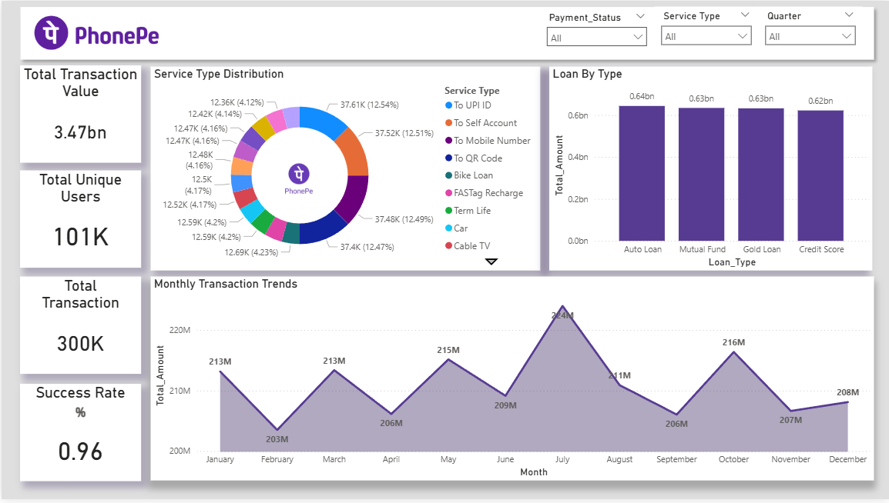
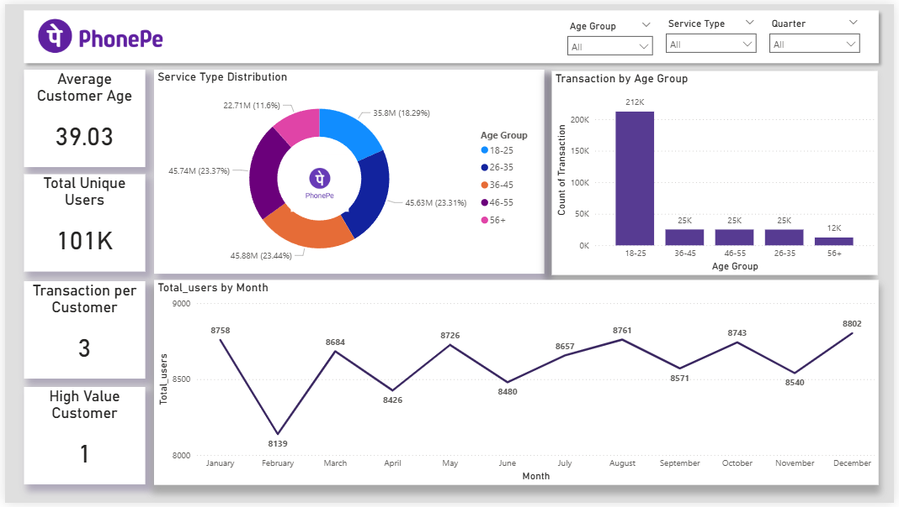
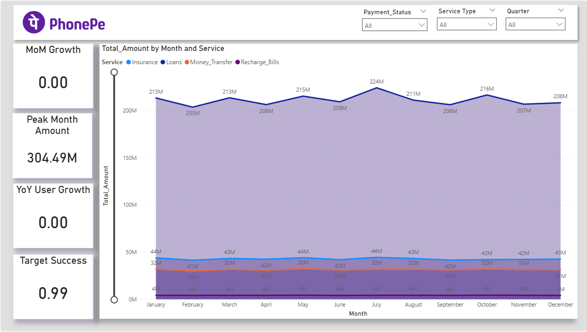

# PhonePe Payments Analytics Dashboard

## Overview
This project is a **Power BI analytics dashboard** built to analyze a digital payments platform PhonePe.  
It covers **transactions, customers, services, and growth** across four dashboard pages.

The objective is to show **business understanding, clean data modeling, and insight-driven analysis**.

### HOME

---

## Key Highlights
- **Total Transaction Value:** ₹3.47B  
- **Total Transactions:** ~300K  
- **Total Users:** ~101K  
- **Overall Success Rate:** ~96%  
- **Growth Peak:** March (₹30.46M MoM)  
- **VIP Segment:** Age 18–25 with ₹18.1K average transaction size  
- **Market Signal:** 0% YoY user growth indicates platform maturity  

---

## Dashboard Pages

### 1. Executive Summary
**Purpose:** Overall business performance  
- Transaction value, volume, users, success rate  
- Monthly and quarterly trends  
- UPI identified as the main transaction channel  

**Key Insight:**  
The platform is stable and scalable with strong seasonal value spikes.

### Executive Summary

---

### 2. Customer Analytics
**Purpose:** User behavior and acquisition analysis  
- Age group distribution  
- Monthly user onboarding trends  
- Quarter-wise demographic shifts  

**Key Insight:**  
The **18–25 age group** is the most valuable segment, especially in Q4.

### Customer Analytics

---

### 3. Service Performance
**Purpose:** Service-level revenue and reliability  
- Revenue mix by service type  
- Payment success rates  
- UPI transfer flow analysis  

**Key Insight:**  
Money Transfer drives most revenue, while Loan services show near-perfect execution.

### Service Performance

---

### 4. Growth Insights
**Purpose:** Growth momentum and sustainability  
- Month-on-month growth trends  
- Peak growth month identification  
- Year-over-year user growth analysis  

**Key Insight:**  
True growth peaked in **March**, while user growth is flat, indicating a mature market.

### Growth Insights

---

## Technical Implementation

### Data Model
- Star schema design  
- Separate date columns for:
  - **Transaction activity**
  - **User acquisition (cohort analysis)**  
- Clean relationships enabling full slicer interaction  

### Power BI Features
- Fully responsive slicers (Quarter, Age Group, Payment Status)  
- Optimized axis types for accurate filtering  
- Consistent metrics across all pages  

---

## Key Business Insights

| Insight | Business Meaning | Pages |
|-------|------------------|-------|
| Q4 millennials drive high value | 56% higher avg transaction size | 2, 3 |
| Insurance leads true growth | March ₹30.46M peak | 4 |
| 0% YoY users | Mature, saturated market | 2, 4 |
| Loan success at 100% | Strong operational reliability | 3 |

---

